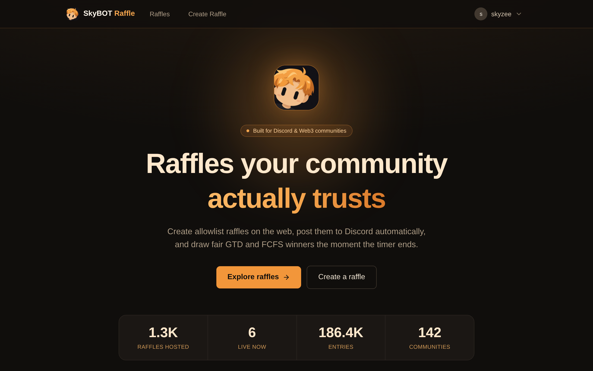
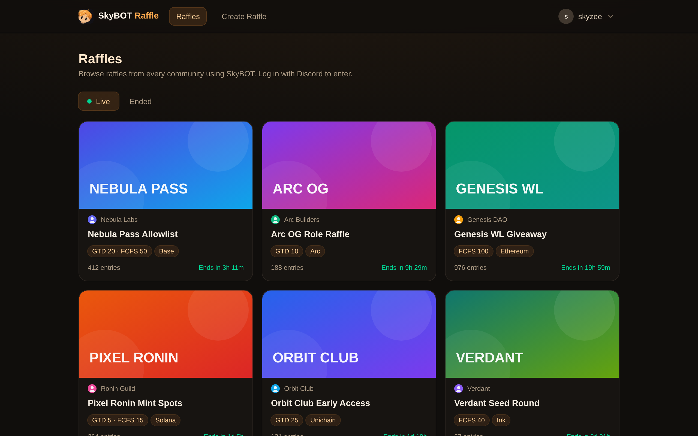
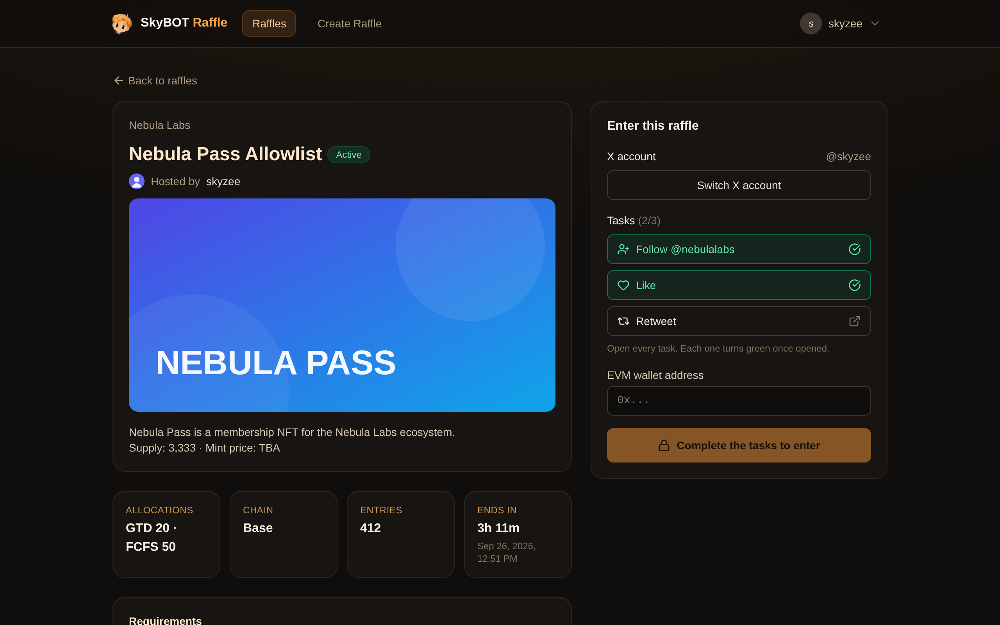
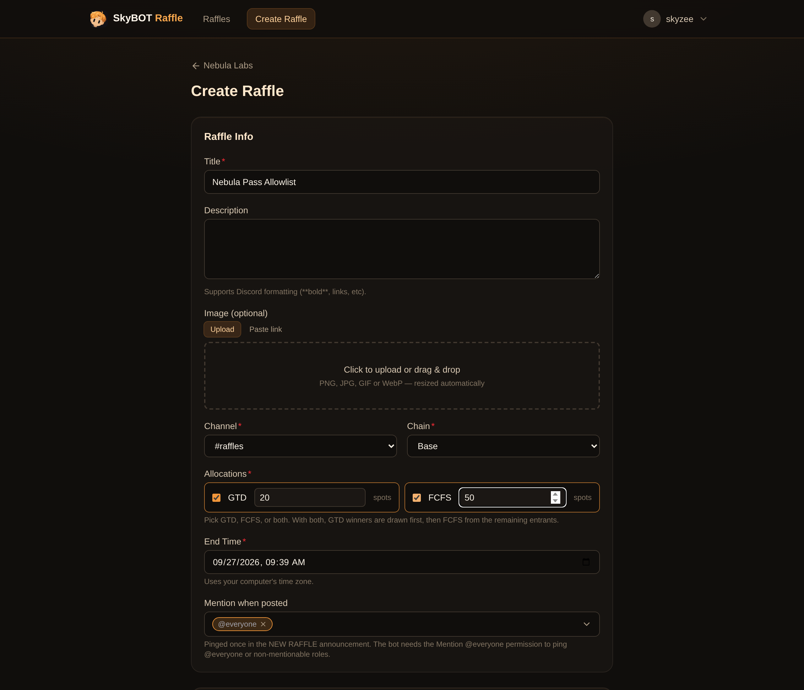
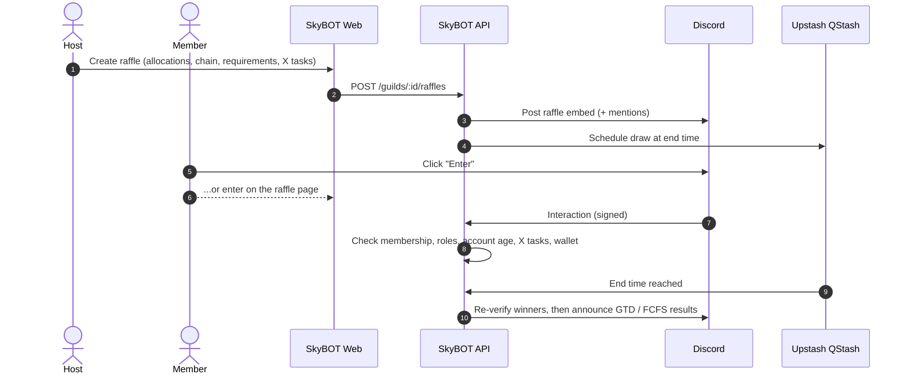

<div align="center">


# SkyBOT Raffle

**Discord raffles with a real web experience.**<br/>
Create allowlist raffles on the web, post them to Discord automatically, let members enter from Discord or the browser,
and draw fair GTD / FCFS winners the moment a raffle ends.

[**Open SkyBOT Raffle**](https://skybot-raffle.vercel.app) · [Features](#features) · [How it works](#how-it-works) · [Deployment](#deployment) · [License](#license)


<br/>



</div>

---

## Overview

SkyBOT Raffle is a raffle platform for Web3 and Discord communities. Community managers create a raffle once on the
web dashboard; the bot publishes it to a Discord channel and keeps it updated. Members can enter with a single click in
Discord, or through the public raffle page on the web, and every entry goes through the same requirement checks.

When the timer runs out, winners are drawn with a cryptographically secure random generator, requirements are
re-verified against Discord, and the results are announced in the channel, split by allocation type.

## Features

<table>
<tr>
<td width="50%" valign="top">

### Raffles
- **GTD & FCFS allocations** with separate spot counts. GTD is drawn first, then FCFS from the remaining pool, so no
  one can win twice
- **Chain selection**: Ethereum, Base, Robinhood, Ink, Arc, Unichain, Solana, or any custom chain
- **Hosted by** line with the host's Discord name and avatar
- Mention `@everyone` or selected roles when a raffle is posted
- End early, cancel, or disqualify entrants at any time

</td>
<td width="50%" valign="top">

### Entry requirements
- **Server membership**, configurable per raffle (members only, or open to everyone on the web)
- **Required roles** (entrants need at least one)
- **Minimum Discord account age** to discourage alt accounts
- **Wallet submission** (EVM or Solana), unique per raffle and matched to the chain
- **X (Twitter) tasks**: follow, like, retweet and quote, with tracked task links

</td>
</tr>
<tr>
<td width="50%" valign="top">

### Web experience
- Landing page with live platform stats and raffles that are live right now
- Public **raffle browser** (`/raffles`) with Live and Ended tabs, no login required to browse
- **Enter from the browser** with the same rules as Discord
- Public **entrant list** (Discord name and avatar only) with winner badges
- Countdown timers, invite-link "Join server" flow, and mobile-friendly layout

</td>
<td width="50%" valign="top">

### Management
- **Raffle manager roles**: delegate raffle management without Manage Server permission
- Full entrant data for hosts: wallets, X accounts, quote links
- **Excel export** of winners with separate GTD and FCFS tables
- Hidden, PIN-protected **admin statistics** page

</td>
</tr>
</table>

<div align="center">

<br/><br/>


</div>

## How it works



### Fairness and integrity
- Winners are picked with Node's `crypto.randomInt` (a CSPRNG), never `Math.random`.
- Ending a raffle is an atomic `ACTIVE → ENDED` transition, so a draw can never run twice.
- Every winner is re-checked at draw time (server membership, roles, account age). Anyone who no longer qualifies is
  disqualified and replaced automatically.
- One entry per Discord account, one wallet per raffle, and one X account per Discord account.

## Tech stack

| Layer | Technology |
|---|---|
| Frontend | React 19, React Router, Vite, Tailwind CSS 4, lucide icons |
| Backend | Express 5 on Vercel Functions, Zod validation |
| Discord | discord.js REST + HTTP interactions (no gateway process to keep alive) |
| Database | PostgreSQL on Neon, Prisma ORM |
| Scheduling | Upstash QStash for exact draw times, Vercel Cron as a safety net |
| X integration | OAuth 1.0a sign-in (no paid X API tier required) |

## Deployment

SkyBOT Raffle runs entirely on free tiers: Vercel, Neon and Upstash.

<details>
<summary><b>1. Database (Neon)</b></summary>

1. Create a project at [neon.tech](https://neon.tech). A region close to your users is recommended.
2. Click **Connect**, turn **off** *Connection pooling*, and copy the connection string into `DATABASE_URL`.
</details>

<details>
<summary><b>2. Discord application</b></summary>

1. Create an application at the [Discord Developer Portal](https://discord.com/developers/applications).
2. **General Information**: copy *Application ID* → `DISCORD_CLIENT_ID` and *Public Key* → `DISCORD_PUBLIC_KEY`.
3. **Bot**: *Reset Token* → `DISCORD_BOT_TOKEN`. No privileged intents are needed.
4. **OAuth2**: *Reset Secret* → `DISCORD_CLIENT_SECRET`.
</details>

<details>
<summary><b>3. Vercel project</b></summary>

1. Run `npx vercel` in the project folder and follow the prompts. The first deploy may fail until the environment
   variables are set.
2. Note your domain: `PUBLIC_URL = https://<project>.vercel.app`.
</details>

<details>
<summary><b>4. Upstash QStash</b></summary>

Open **QStash** in the [Upstash console](https://console.upstash.com) and copy `QSTASH_URL`, `QSTASH_TOKEN`,
`QSTASH_CURRENT_SIGNING_KEY` and `QSTASH_NEXT_SIGNING_KEY`.
</details>

<details>
<summary><b>5. X Developer app (optional)</b></summary>

1. Create an app at [developer.x.com](https://developer.x.com).
2. **User authentication settings → Set up**: permissions **Read**, type **Web App**, callback
   `https://<project>.vercel.app/api/x/callback`, website `https://<project>.vercel.app`.
3. **Keys and tokens → Consumer Keys** → `X_API_KEY` and `X_API_SECRET`.
</details>

<details>
<summary><b>6. Environment variables and deploy</b></summary>

Add every variable from [`.env.example`](.env.example) under **Vercel → Settings → Environment Variables**, then run
`npx vercel --prod`. Database tables are created automatically during the build.
</details>

<details>
<summary><b>7. Connect Discord to the app</b></summary>

In the Discord Developer Portal:
1. **OAuth2 → Redirects**: `https://<project>.vercel.app/api/auth/callback`
2. **General Information → Interactions Endpoint URL**: `https://<project>.vercel.app/api/interactions`

Then sign in on the web, pick a server and invite the bot. It needs **View Channel, Send Messages, Embed Links, Read
Message History, Mention Everyone** and **Manage Roles**.
</details>

### Environment variables

| Variable | Required | Description |
|---|:---:|---|
| `DISCORD_CLIENT_ID` | Yes | Discord application ID |
| `DISCORD_PUBLIC_KEY` | Yes | Used to verify Discord interaction signatures |
| `DISCORD_CLIENT_SECRET` | Yes | OAuth2 client secret for web login |
| `DISCORD_BOT_TOKEN` | Yes | Bot token for posting and reading members |
| `DATABASE_URL` | Yes | PostgreSQL connection string (unpooled) |
| `PUBLIC_URL` | Yes | Public URL of the deployment |
| `NODEJS_HELPERS` | Vercel | Must be `0` so request bodies can be signature-checked |
| `QSTASH_*` | Recommended | Exact-time draw scheduling |
| `CRON_SECRET` | Recommended | Protects the daily safety-net cron |
| `X_API_KEY`, `X_API_SECRET` | Optional | Enables X tasks |
| `ADMIN_PIN` | Optional | 6–12 digit PIN for `/admin`; leave empty to disable |

## Local development

```bash
cp .env.example .env        # fill in the values, with PUBLIC_URL=http://localhost:5173
npm install
npm run db:push
npm run dev                 # API on :3000, web on :5173
```

Discord buttons and X sign-in need a public URL, so test those flows on a Vercel preview deployment.

| Script | Description |
|---|---|
| `npm run dev` | Start the API server and the Vite dev server together |
| `npm run build` | Generate the Prisma client, sync the schema and build the web app |
| `npm run typecheck` | Type-check the whole project |
| `npm run db:studio` | Browse the database with Prisma Studio |

## Project structure

```
api/index.ts            Vercel Function entry point
src/server/
  app.ts                Express app and route mounting
  api/                  auth, dashboard, public, admin, interactions, X auth, cron
  raffle/               draw logic, requirements, embeds, X tasks, scheduling
  xlsx.ts               Dependency-free Excel writer
src/shared/             Code shared by server and web (chains, allocations, paths)
src/web/                React frontend (pages, components, icons)
prisma/schema.prisma    Database schema
docs/                   Logo and screenshots
```

## Security and privacy

- Discord interactions are verified with Ed25519 signatures; QStash and cron callbacks are signed as well.
- Sessions use random, httpOnly cookies. Login and X sign-in redirects only accept internal paths.
- Public pages show entrants' Discord names and avatars only. Wallets, X accounts and quote links are visible to the
  raffle's hosts and managers.
- The admin page PIN lives in an environment variable, never in code, and wrong attempts are rate limited.
- X tasks cannot be verified through the free X API. The bot records that each task link was opened, not that the
  action was completed, so verify winners manually for high-value raffles.

## License

**Proprietary. All rights reserved.** The source code is available for reference only. Copying, modifying, deploying
or redistributing it requires written permission. See [LICENSE](LICENSE) for details.

<div align="center">
<br/>
Built by <a href="https://x.com/SkyzeeReal">@SkyzeeReal</a>
</div>
